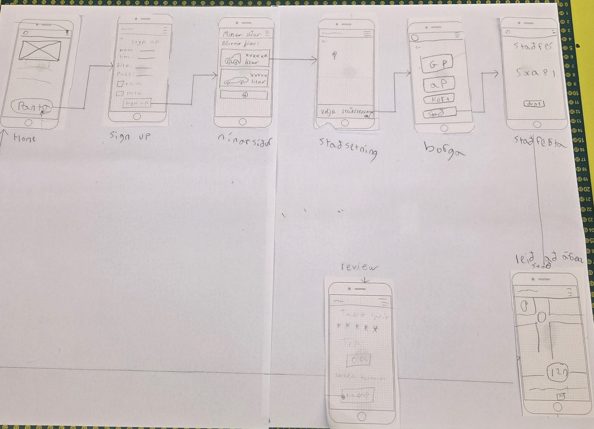

# User Stories

**Aldur er alltaf yfir 17 ára**

- **Sem notandi sem þarf að koma bílnum mínum frá A til Ö**  
  vill ég geta pantað ökumann í appinu sem keyrir bílinn minn á milli staða  
  svo að ég geti farið aðra leið sjálf/ur en samt fengið bílinn minn á réttan stað.  

- **Sem notandi sem er fullur eftir djamm**  
  vill ég geta pantað ökumann í appinu sem keyrir mig og bílinn minn heim  
  svo að ég brjóti ekki lög eða setji sjálfan mig/aðra í hættu með því að keyra fullur.  

- **Sem notandi sem er of þreyttur til að keyra örugglega**  
  vill ég geta pantað ökumann í appinu sem keyrir mig og bílinn minn  
  svo að ég komist á áfangastað án þess að stofna mér eða öðrum í hættu.  

- **Sem notandi sem þarf að sækja bílinn minn**  
  vill ég geta bókað ökumann í appinu, sett inn staðsetningu bílsins  
  og látið ökumanninn sækja bílinn svo að ég þurfi ekki að biðja vin um að hjálpa mér eða fara sjálfur.  

- **Sem ökumaður sem þarf að keyra bíla notanda á áfangastað**  
  vill ég geta fengið staðsetningu bíl notandans og áfangastað bílsins í gegnum appið  
  svo að ég viti hvert ég á að fara með bílinn.  

- **Sem bílstjóri/umsjónarmaður**  
  vill ég sjá kort með staðsetningu allra tiltækra ökumanna í rauntíma í gegnum appið  
  svo að ég geti valið þann sem er best staðsettur fyrir nýtt verkefni.  

---

# Almenn lýsing

Vef- og snjallforritið býður notendum, sem eru yfir 17 ára, upp á þjónustu þar sem hægt er að panta ökumann til að keyra bíl notandans frá einum stað til annars.  
Markmið forritsins er að tryggja að einstaklingar geti komið bílnum sínum á áfangastað á öruggan hátt, jafnvel þó þeir sjálfir geti ekki eða vilji ekki keyra.

---

# Wireframe:

